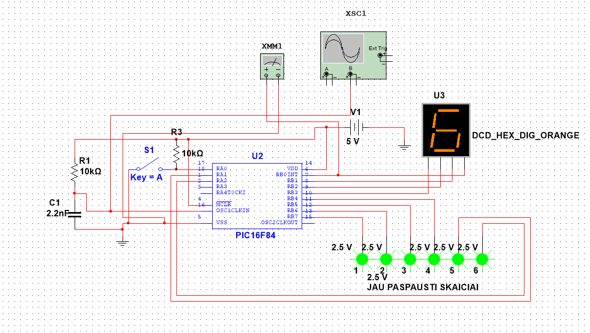

# RollTheDiceInAssembly
Rolling dice in assembly language with PIC16F84

# PIC16F84 Dice Simulation



This is a dice simulation program that allows the user to control the operation of the PIC16F84 microcontroller. The program uses a 7-segment display to simulate rolling a dice.
Project was done in Multisim 12

## Project Information

- **Tools Used:** Multisim software, PIC16F84 microcontroller.

## Features

- Simulate rolling a dice using a 7-segment display.
- Track all rolled numbers and light up corresponding LEDs.
- Generate random numbers for dice rolls.
- Tracks if all 6 dice numbers are rolled.

## Instructions

- Download the assembly code.
- Copy it into your microcontroller programming environment.
- Run the program on the microcontroller.


## Conclusion
This program serves as an excellent starting point for understanding microcontroller operation. It demonstrates how to use a 7-segment display and control LEDs using the PIC16F84 microcontroller.

## Code
```assembly

; itraukti PIC16F84
#include "p16f84.inc"
	__CONFIG _CP_OFF & _WDT_OFF & _PWRTE_ON & _RC_OSC ; Konfiguruojami mikrovaldiklio nustatymai


	ORG 0x00 ; Programos pradzia


RandomNumber EQU 0x23 ; kintamuju nustatytimas
NumberToDisplay EQU 0x25 ;kintamuju nustatytimas
ButtonPressed EQU 0x24 ; Mygtuko paspaudimas
DisplayCounter EQU 0x22 ; Skaitiklis ekranui
ButtonState EQU 0x26 ; Mygtuko busena
ButtonProcessed EQU 0x27 ; Mygtuko ivykio apdorojimas


	; Inicializuojami registrai ir nustatymai
	MOVLW 0x00 ; Uzkraunamas 0x00 i W registra
	MOVWF RandomNumber ; Issaugomas W registras i RandomNumber
	MOVLW 0x00 ; Uzkraunamas 0x00 i W registra
	MOVWF NumberToDisplay ; Issaugomas W registras i NumberToDisplay
	BCF ButtonPressed, 0 ; Valdomas mygtuko paspaudimo registras
	BCF ButtonState, 0 ; Valdoma mygtuko busenos registras
	BCF ButtonProcessed, 0 ; Valdomas mygtuko ivykio apdorojimo registras

	BSF STATUS, RP0 ; Pakeiciamas bankas 1
	MOVLW B'00000000' ; Uzkraunamas W registras su bitais
	MOVWF TRISB ; Issaugomas W registras TRISB
	BCF STATUS, RP0 ; Pakeiciamas bankas 0

	BSF STATUS, RP0 ; Pakeiciamas bankas 1
	BCF TRISA, 1 ; Isjungiamas RA1 isejimas
	BCF TRISA, 2 ; Isjungiamas RA2 isejimas
	BCF STATUS, RP0 ; Pakeiciamas bankas 0

	BCF PORTB, 4 ; Isjungiamas PORTB bitas 4
	BCF PORTB, 5 ; Isjungiamas PORTB bitas 5
	BCF PORTB, 6 ; Isjungiamas PORTB bitas 6
	BCF PORTB, 7 ; Isjungiamas PORTB bitas 7
	BCF PORTA, 1 ; Isjungiamas PORTA bitas 1
	BCF PORTA, 2 ; Isjungiamas PORTA bitas 2

Main_Loop:

	INCF RandomNumber, F ; Inkrementuojamas RandomNumber registras

	BTFSC PORTA, 0 ; Tikrinama, ar PORTA bitas 0 yra nustatytas
	BTFSC ButtonState, 0 ; Tikrinama, ar ButtonState bitas 0 yra nustatytas
	GOTO ButtonNotPressed ; Jei taip, eiti i ButtonNotPressed

	CALL buttonFunction ; Iskviesti funkcija buttonFunction
	BSF ButtonState, 0 ; Nustatyti ButtonState bita
	GOTO Main_Loop ; Grzsti i pagrindini cikla

ButtonNotPressed:

	BTFSS PORTA, 0 ; Tikrinama, ar PORTA bitas 0 nera nustatytas
	GOTO buttonReleased ; Jei taip, eiti i buttonReleased
	GOTO Main_Loop ; Kitu atveju gryzti i pagrindini cikla

buttonReleased:
	BCF ButtonState, 0 ; Isvalyti ButtonState bita 0
	BCF ButtonProcessed, 0 ; Isvalyti ButtonProcessed bita 0
	CALL clear ; Isvalyti ekrana

	CALL DisplayLoop ; Iskviesti DisplayLoop funkcija

CHECK_PINS_LOOP:
	BTFSS PORTB, 4 ; Tikrinama, ar PORTB bitas 4 nera nustatytas
	GOTO PIN_HIGH ; Jei taip, eiti ? PIN_HIGH
	BTFSS PORTB, 5 ; Tikrinama, ar PORTB bitas 5 nera nustatytas
	GOTO PIN_HIGH ; Jei taip, eiti ? PIN_HIGH
	BTFSS PORTB, 6 ; Tikrinama, ar PORTB bitas 6 nera nustatytas
	GOTO PIN_HIGH ; Jei taip, eiti ? PIN_HIGH
	BTFSS PORTB, 7 ; Tikrinama, ar PORTB bitas 7 nera nustatytas
	GOTO PIN_HIGH ; Jei taip, eiti ? PIN_HIGH
	BTFSS PORTA, 1 ; Tikrinama, ar PORTA bitas 1 nera nustatytas
	GOTO PIN_HIGH ; Jei taip, eiti ? PIN_HIGH
	BTFSS PORTA, 2 ; Tikrinama, ar PORTA bitas 2 nera nustatytas
	GOTO PIN_HIGH ; Jei taip, eiti ? PIN_HIGH
	GOTO PINS_OFF ; Eiti ? PINS_OFF

PIN_HIGH:

	GOTO Main_Loop ; Gryzti i pagrindini cikla

PINS_OFF:

	BCF PORTB, 4 ; Isvalyti PORTB bita 4
	BCF PORTB, 5 ; Isvalyti PORTB bita 5
	BCF PORTB, 6 ; Isvalyti PORTB bita 6
	BCF PORTB, 7 ; Isvalyti PORTB bita 7
	BCF PORTA, 1 ; Isvalyti PORTA bita 1
	BCF PORTA, 2 ; Isvalyti PORTA bita 2
	GOTO Main_Loop ; Gryzti i pagrindini cikla

DisplayLoop:

	MOVF RandomNumber, W ; Perkelti RandomNumber i W registra
	SUBLW 6 ; Atimti sesis nuo W registro
	BTFSS STATUS, Z ; Tikrinti, ar zenklas Z (nulis) nustatytas

	RETURN ; Jei ne, gryzti

	CALL makeZero ; Iskviesti funkcija makeZero

	RETURN ; Gryzti

makeZero:

	MOVLW 0x00 ; Uzkraunamas 0x00 i W registra
	MOVWF RandomNumber ; Issaugomas W registras RandomNumber

	RETURN ; Gryzti

DisplayNumber:

	MOVLW 0x00 ; Uzkraunamas 0x00 i W registra
	XORWF NumberToDisplay, W ; XOR operacija su NumberToDisplay ir W, rezultatas i W
	BTFSC STATUS, Z ; Tikrinti, ar zenklas Z (nulis) nustatytas
	CALL clear ; Jei taip, isvalyti ekrana

	MOVLW 0x01 ; Uzkraunamas 0x01 i W registra
	XORWF NumberToDisplay, W ; XOR operacija su NumberToDisplay ir W, rezultatas i W
	BTFSC STATUS, Z ; Tikrinti, ar ?enklas Z (nulis) nustatytas
	CALL DIGIT_1 ; Jei taip, iskviesti DIGIT_1 funkcija

	MOVLW 0x02 ; Uzkraunamas 0x02 i W registra
	XORWF NumberToDisplay, W ; XOR operacija su NumberToDisplay ir W, rezultatas i W
	BTFSC STATUS, Z ; Tikrinti, ar zenklas Z (nulis) nustatytas
	CALL DIGIT_2 ; Jei taip, iskviesti DIGIT_2 funkcija

	MOVLW 0x03 ; Uzkraunamas 0x03 i W registra
	XORWF NumberToDisplay, W ; XOR operacija su NumberToDisplay ir W, rezultatas i W
	BTFSC STATUS, Z ; Tikrinti, ar zenklas Z (nulis) nustatytas
	CALL DIGIT_3 ; Jei taip, iskviesti DIGIT_3 funkcija

	MOVLW 0x04 ; Uzkraunamas 0x04 i W registra
	XORWF NumberToDisplay, W ; XOR operacija su NumberToDisplay ir W, rezultatas i W
	BTFSC STATUS, Z ; Tikrinti, ar zenklas Z (nulis) nustatytas
	CALL DIGIT_4 ; Jei taip, iskviesti DIGIT_4 funkcija

	MOVLW 0x05 ; Uzkraunamas 0x05 i W registra
	XORWF NumberToDisplay, W ; XOR operacija su NumberToDisplay ir W, rezultatas i W
	BTFSC STATUS, Z ; Tikrinti, ar zenklas Z (nulis) nustatytas
	CALL DIGIT_5 ; Jei taip, iskviesti DIGIT_5 funkcija

	MOVLW 0x06 ; uzkraunamas 0x06 i W registra
	XORWF NumberToDisplay, W ; XOR operacija su NumberToDisplay ir W, rezultatas i W
	BTFSC STATUS, Z ; Tikrinti, ar zenklas Z (nulis) nustatytas
	CALL DIGIT_6 ; Jei taip, iskviesti DIGIT_6 funkcija

	RETURN ; Gryzti

clear:

	BCF PORTB, 0 ; Isvalyti PORTB bita 0
	BCF PORTB, 1 ; Isvalyti PORTB bita 1
	BCF PORTB, 2 ; Isvalyti PORTB bita 2
	BCF PORTB, 3 ; Isvalyti PORTB bita 3

	RETURN ; Gryzti

DIGIT_1:

	BSF PORTB, 0 ; Nustatyti PORTB bita 0
	BCF PORTB, 1 ; Isvalyti PORTB bita 1
	BCF PORTB, 2 ; Isvalyti PORTB bita 2
	BCF PORTB, 3 ; Isvalyti PORTB bita 3
	BSF PORTB, 7 ; Nustatyti PORTB bita 7

	RETURN ; Gryzti

DIGIT_2:

	BSF PORTB, 1 ; Nustatyti PORTB bita 1
	BCF PORTB, 2 ; Isvalyti PORTB bita 2
	BCF PORTB, 0 ; Isvalyti PORTB bita 0
	BCF PORTB, 3 ; Isvalyti PORTB bita 3
	BSF PORTB, 6 ; Nustatyti PORTB bita 6

	RETURN ; Gryzti

DIGIT_3:

	BSF PORTB, 0 ; Nustatyti PORTB bita 0
	BSF PORTB, 1 ; Nustatyti PORTB bita 1
	BCF PORTB, 2 ; Isvalyti PORTB bita 2
	BCF PORTB, 3 ; Isvalyti PORTB bita 3
	BSF PORTB, 5 ; Nustatyti PORTB bita 5

	RETURN ; Gryzti

DIGIT_4:

	BSF PORTB, 2 ; Nustatyti PORTB bita 2
	BCF PORTB, 1 ; Isvalyti PORTB bita 1
	BCF PORTB, 0 ; Isvalyti PORTB bita 0
	BCF PORTB, 3 ; Isvalyti PORTB bita 3
	BSF PORTB, 4 ; Nustatyti PORTB bita 4

	RETURN ; Gryzti

DIGIT_5:

	BSF PORTB, 0 ; Nustatyti PORTB bita 0
	BSF PORTB, 2 ; Nustatyti PORTB bita 2
	BCF PORTB, 1 ; I?valyti PORTB bita 1
	BCF PORTB, 3 ; I?valyti PORTB bita 3
	BSF PORTA, 1 ; Nustatyti PORTA bita 1

	RETURN ; Gryzti

DIGIT_6:

	BSF PORTB, 1 ; Nustatyti PORTB bita 1
	BSF PORTB, 2 ; Nustatyti PORTB bita 2
	BCF PORTB, 0 ; Isvalyti PORTB bita 0
	BCF PORTB, 3 ; Isvalyti PORTB bita 3
	BSF PORTA, 2 ; Nustatyti PORTA bita 2

	RETURN ; Gryzti

buttonFunction:

	BTFSC ButtonProcessed, 0 ; Tikrinti, ar ButtonProcessed bitas 0 nustatytas
	RETURN ; Jei taip, gryzti

	MOVLW 0x01 ; Uzkraunamas 0x01 i W registra
	MOVWF ButtonProcessed ; Issaugomas W registras ButtonProcessed

	MOVF RandomNumber, W ; Perkelti RandomNumber i W registra
	MOVWF NumberToDisplay ; Issaugomas W registras NumberToDisplay
	CALL DisplayNumber ; Iskviesti DisplayNumber funkcija

	RETURN ; Gryzti

delay:

	MOVLW D'100' ; Uzkraunamas velinimo laikas
	MOVWF DELAY_COUNT ; Issaugomas DELAY_COUNT registras

DELAY_LOOP:

	DECFSZ DELAY_COUNT, F ; Mazinti DELAY_COUNT ir tikrinti, ar nulis
	GOTO DELAY_LOOP ; Jei ne nulis, gryzti i DELAY_LOOP

	RETURN ; Gryzti

DELAY_COUNT EQU 0x20 ; DELAY_COUNT konstanta

	END ; Programos pabaiga


